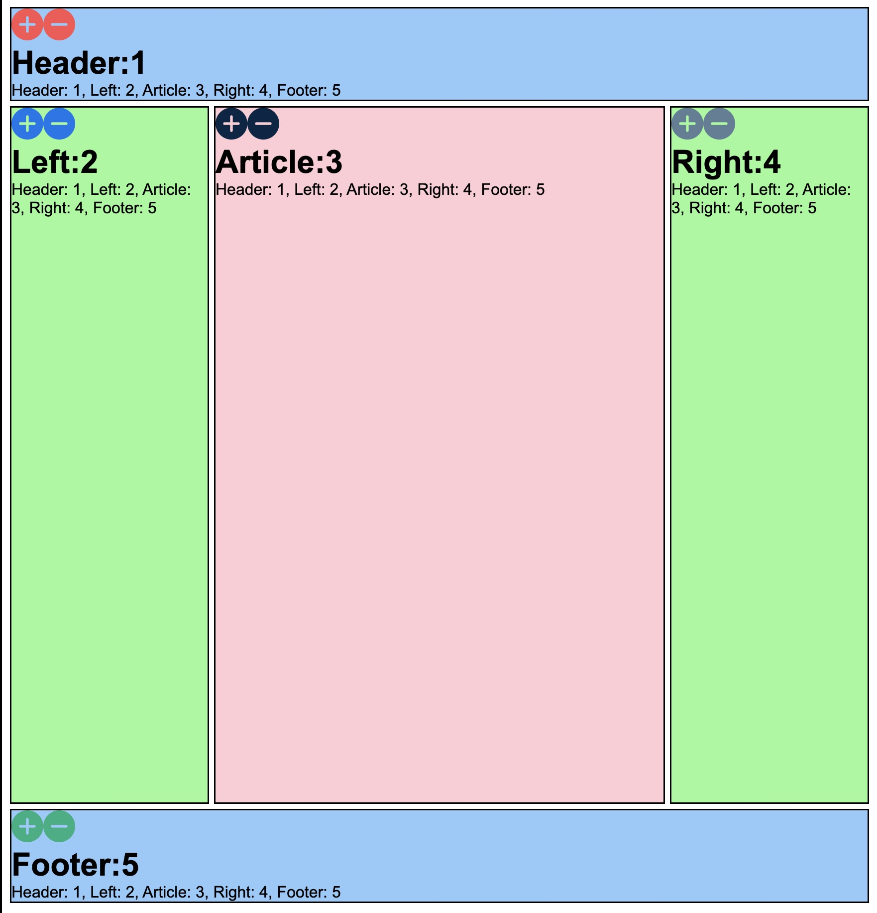

# Full Stack Holy Grail Application

## Description

A full stack application that displays a holy grail file and keeps a count for each component. 
Stack: Redis, Express, React, Node.js

## Installation

1. Simply download the project folder to your local machine or fork the project
2. Navigate to the root folder within the terminal
3. Run <code>npm install</code> and <code>node index.js</code>.

Navigate to localhost:3000 within your local browser to view the running application!

## Future Improvements

Style improvements. 

## MIT License

Permission is hereby granted, free of charge, to any person obtaining a copy
of this software and associated documentation files (the "Software"), to deal
in the Software without restriction, including without limitation the rights
to use, copy, modify, merge, publish, distribute, sublicense, and/or sell
copies of the Software
